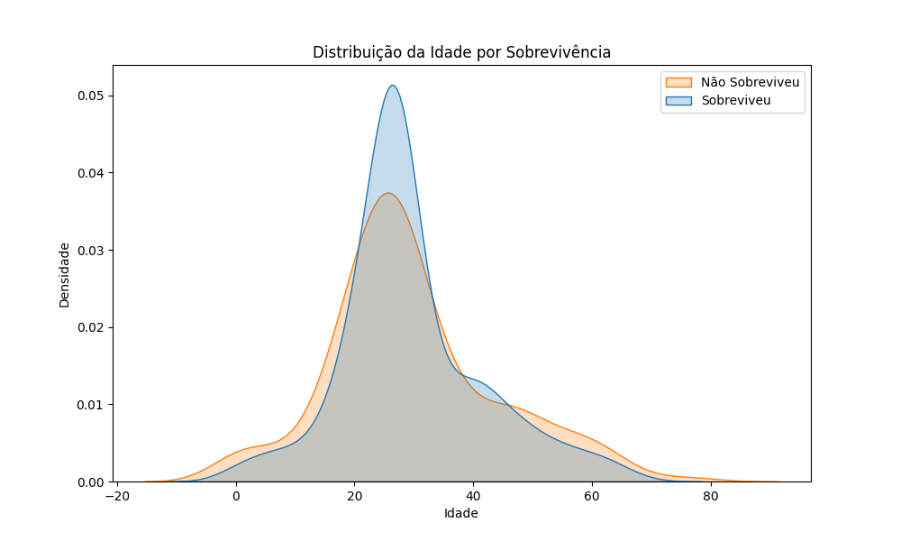
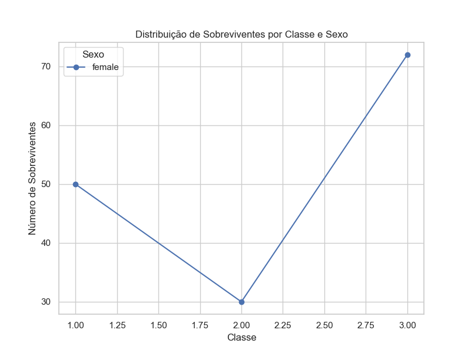
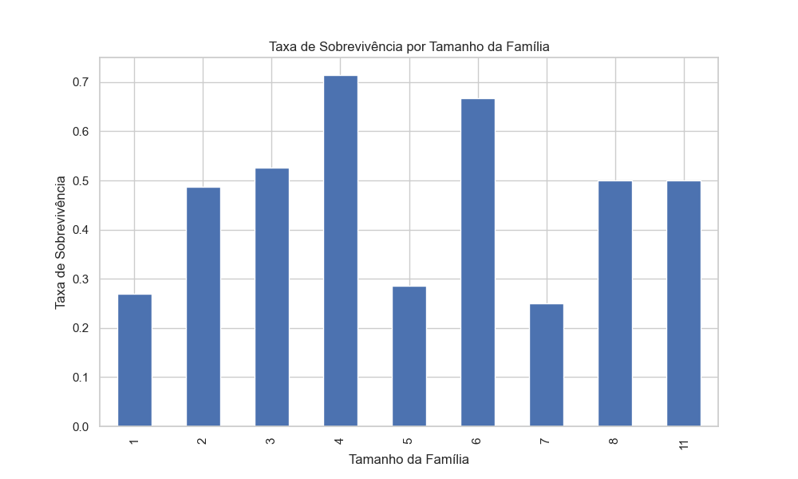
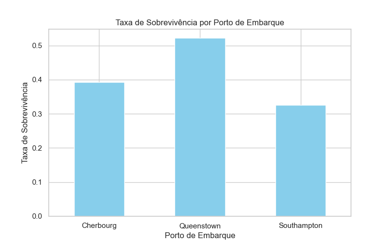

# **Titanic Survival Data Analysis**
**Lab Project**
Developed by **Diogo Louro, Ricardo Conceição, and João Pedro Silva**

---

## ** Project Description**
This project involves **exploratory analysis and preprocessing** of the Titanic dataset using Python, Pandas, Seaborn, and SQLite. The goal is to explore survival patterns among passengers, clean and transform the data, and visualize key insights.


## ** Project Structure**
- **`titanic.csv`**: Original dataset.
- **`titanic_tratado.csv`**: Cleaned and preprocessed dataset.
- **`titanic_tratado_com_idade.csv`**: Dataset with the `Idade_Milissegundos` column.
- **`titanic_tratado_com_idade_final.csv`**: Final dataset with all transformations.
- **`dados.db`**: SQLite database containing the `passageiros` table.

---

## ** Technologies Used**
- **Python** (Pandas, NumPy, Seaborn, Matplotlib, Statsmodels)
- **SQLite** (data storage)
- **Excel/OpenPyXL** (file manipulation)

---

## ** Activities Performed**

### **1. Data Reading and Exploration**
- Loaded the `titanic.csv` dataset.
- Viewed the first and last records.
- Conducted statistical analysis of numeric and non-numeric columns.

### **2. Data Cleaning and Preprocessing**
- **Handling missing values**:
  - `Age` and `Fare`: Filled with the median.
  - `Cabin`: Filled with "Unknown".
- Saved the cleaned dataset as `titanic_tratado.csv`.

### **3. Data Transformation**
- **Calculated age in milliseconds** since the Unix Epoch (1970).
- Created the `Idade_Milissegundos` column.

### **4. Survival Analysis**
- **Mortality and survival rates by gender**.
- **Survival rates by class and gender**.
- **Average age by survival status**.
- **Visualizations**:
  - Age distribution by survival.
  - Correlation between `Age`, `Fare`, and `Survived`.

### **5. Additional Analysis**
- **Family size and survival**:
  - Created the `Tamanho_Familia` column (SibSp + Parch + 1).
  - Survival rate by family size.
- **Embarkation port and survival**:
  - Mapped ports (`C`, `Q`, `S`).
  - Survival rate by embarkation port.

### **6. Export and Storage**
- Exported the final dataset to `titanic_tratado_com_idade_final.csv`.
- Stored the data in an **SQLite database** (`dados.db`).

---

## ** Results and Insights**
- **Women had a significantly higher survival rate** than men.
- **First-class passengers** were more likely to survive.
- **Children and young adults** (especially in 2nd and 3rd class) had higher survival rates.
- **Embarkation port**: Passengers who embarked at **Cherbourg** had a higher survival rate.

---

## ** Visualizations**
### **Age Distribution by Survival**
<p align="center">
  
</p>

### **Survival Rate by Class and Gender**
<p align="center">
  
</p>

### **Family Size vs. Survival**
<p align="center">
  
</p>

### **Additional Analysis - Comparison by Port of Shipment**
<p align="center">
  
</p>

---

## **🛠 How to Reproduce the Analysis**
1. **Clone the repository**:
   ```bash
   git clone https://github.com/your_username/ProjectoFinal.git
   
2. **Install dependencies**:
    ```bash
   pip install pandas openpyxl seaborn matplotlib statsmodels sqlite3

3. **Run the script**:
    ```bash   
    python titanic_analysis.py

---

## ** Conclusions**

Social class and gender were decisive factors in survival.
Larger families (especially with children) had an advantage.
Embarkation port may indicate socioeconomic differences among passengers.

📧 Contact: diogolouro@outlook.com
